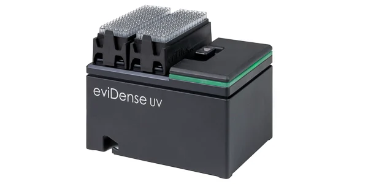

# eviDense UV Photometer Integration Manual

## 1. Introduction



The eviDense UV module is an ultra-compact 4-color UV absorbance-based photometer which enables full Quality Control on liquid handlers. 
For more information see [www.on-deck-photometer.com](https://www.hseag.com/on-deck-photometer). To control the eviDense UV module, HSE AG provides software interfaces in C, Python or C#.

### 1.1 Purpose of This Manual

This manual describes how to use the eviDense UV Photometer software interfaces from a user perspective.
It focuses on practical handling and separates language-independent concepts from language-specific usage.

### 1.2 Supported Software Interfaces

The eviDense UV Photometer software stack provides three interface groups:

- Source code in [C#](./doc/csharp.md) and [Python](./doc/python.md), for applications that require full control over device communication, measurement sequencing, data handling, and integration logic.
- Command line tools in [C](./doc/c-cli.md) and [Python](./doc/python-cli.md), for scripting, automation, and operational workflows without writing a custom application.
- A Python-based [REST API server](./doc/python-rest.md), for controlling the eviDense UV Photometer from external software over HTTP.

### 1.3 Liquid Handler Integrations

The eviDense UV software interfaces are intended to be integrated into liquid-handler-specific workflows.
To keep these integrations maintainable, the robot-specific motion logic should be separated from the photometer control logic so that multiple liquid handler platforms can be documented and supported consistently.

Available integration guides:

- [Opentrons OT-2 integration](./doc/liquid-handler-ot2.md)

### 1.4 Typical Measurement Workflow

A typical workflow with a liquid handler is:

1. Prepare a microtiter plate that contains at least one blank and the sample wells.
2. The blank is the buffer without DNA.
3. The liquid handler picks up a tip and aspirates at least 10 uL of blank or sample liquid.
4. The liquid handler picks up a cuvette with the tip and moves above the cuvette guide.
5. The liquid handler checks that the cuvette guide is empty.
6. The liquid handler starts the first measurement, which is the baseline measurement.
7. The liquid handler moves the cuvette into the cuvette guide and starts the second measurement, which is the air measurement.
8. The liquid handler dispenses 10 uL into the cuvette and starts the third measurement, which is the sample measurement.
9. The liquid handler aspirates the liquid back into the tip.
10. The liquid handler moves out of the cuvette guide and discards the tip together with the cuvette.

See a video of a simple workflow on an Opentrons OT-2 Robot:
[](https://hseag.github.io/evidense/main/doc/images/evidense-workflow.mp4)

## 2. CAD

The following CAD views provide a starting point for mechanical integration of the eviDense UV Photometer.

[Side View](./doc/images/evidense-cad-side.png)

Use this view to understand the side profile, overall height, and the vertical relationship between the device body and the cuvette guide area.

[Top View Calibration](./doc/images/evidense-cad-top-calibration.png)

Use this view to understand the top-side geometry relevant for calibration and positioning in relation to the surrounding system.

[Top View Detail](./doc/images/evidense-cad-top-detail.png)

Use this view to inspect the detailed top-side geometry, including the area around the cuvette guide and nearby mechanical constraints.

### 2.1 Calibration

For calibration, one of the two calibration crosses should be used as the reference position.

### 2.2 Cuvette Pickup

The cuvette should be picked up with the pipette tip.
The cuvette holding force must be at least 8 N.

### 2.3 Cuvette Insertion

The liquid handler should first move the cuvette above the cuvette guide.
After that, the liquid handler should move the cuvette into the cuvette guide.

For teaching the insertion height, it is recommended to use the cuvette guide bottom as the mechanical reference.
In practice, the target position can be taught as 1 mm above the cuvette guide bottom.
For this purpose, the cuvette guide may be pulled out by 1 mm up to the stop, and the position can then be taught accordingly.

As a geometric reference, the lower edge of the cuvette is approximately 48.1 mm above the work deck at the end position.

## 3. Simulation

For development, automated tests, and workflow validation without physical hardware, an eviDense UV simulator is available.

See [Simulator Guide](./doc/simulator.md) for setup, startup commands, web UI usage, CLI control options, and examples for using the simulator with the supported interfaces.

## 4. Troubleshooting

### Self-test failes

For error codes `33008 (0x000080f0)`or `32768 (0x00008000)`, verify that the cuvette guide is empty and inserted correctly.

## 5. Appendix

### 5.1 JSON data file format

All interface implementations produce a JSON data file with the same general structure.
This common file format is used to store measurement runs in a consistent way, independent of whether the data was generated by the C command line interface, the C# interfaces, or the Python interfaces.

The JSON data file is intended for:

- persistent storage of measurement results
- later review and traceability
- post-processing and result calculation
- CSV export
- regression tests and automated comparisons

The file typically contains:

- device information
- measurement parameters
- optional adjustment or calibration information
- one or more stored measurements
- optional calculated results for each measurement
- optional comments, timestamps, and logging information

A measurement entry typically contains the baseline, air, and sample values for all supported channels.
If results have already been calculated, the corresponding result values are stored together with the raw measurement data.

Typical top-level fields:

- `info`: device metadata and API version
- `parameters_run`: run-specific parameters such as the number of blanks and optional factors
- `adjustments`: optional device-specific values such as center wavelengths
- `measurements`: list of stored measurements

Typical measurement entry fields:

- `baseline`: baseline measurement values for 230, 260, 280, and 340 nm
- `air`: air measurement values for 230, 260, 280, and 340 nm
- `sample`: sample measurement values for 230, 260, 280, and 340 nm
- `comment`: optional user comment
- `date_time`: timestamp
- `results`: optional calculated result values
- `logging`: optional device log messages

Example:

```json
{
  "info": {
    "product": "eviDense",
    "serial_number": "SN0012",
    "firmware_version": "9.9.9"
  },
  "measurements": [
    {
        "baseline": {
          "230": { "sample": 4483339, "reference": 830388 },
          "260": { "sample": 4537374, "reference": 651391 },
          "280": { "sample": 4410902, "reference": 745366 },
          "340": { "sample": 4379562, "reference": 701840 }
        },
        "air": {
          "230": { "sample": 612650, "reference": 831473 },
          "260": { "sample": 902925, "reference": 651184 },
          "280": { "sample": 1112422, "reference": 745403 },
          "340": { "sample": 1526914, "reference": 701951 }
        },
        "sample": {
          "230": { "sample": 68578, "reference": 831736 },
          "260": { "sample": 7818, "reference": 651149 },
          "280": { "sample": 141806, "reference": 745326 },
          "340": { "sample": 2221876, "reference": 701920 }
        },
        "comment": "Sample@B5-0",
        "results": {
          "dsDNA": 1007.3174201661793,
          "ssDNA": 664.8294973096782,
          "ssRNA": 805.8539361329434,
          "purity260/230": 2.0967406709273586,
          "purity260/280": 1.9575040959390513,
          "A230": 1.0654133605024299,
          "A260": 2.224586355430195,
          "A280": 1.1405920858980032,
          "A340": 0.008488031064600304
        }
    }
  ]
}
```

The exact JSON content may differ slightly depending on the workflow and interface, but the overall structure is intended to remain compatible across all supported implementations.
