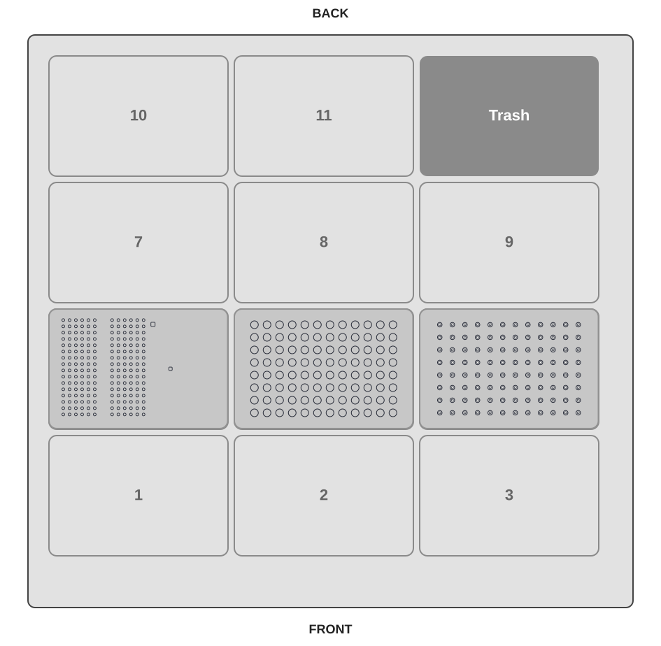

# eviDense OT-2 Device Demo

This guide describes how to run [`evidense_ot2_device_demo.py`](https://hseag.github.io/evidense/pre-release/integration_kits/opentrons-ot2/protocol/evidense_ot2_device_demo.py){ download="evidense_ot2_device_demo.py" } on an Opentrons OT-2. The protocol demonstrates the eviDense device-control sequence: aspirating liquid from a sample plate, picking up a cuvette, moving it into the measurement guide, running eviDense measurements, and disposing of the liquid with the tip.

It is an integration demonstration only. It does not prepare an assay or implement a validated measurement workflow.

## Prerequisites

- Opentrons OT-2 with a P20 single-channel pipette on the left mount
- One full `opentrons_96_filtertiprack_20ul` rack
- One `corning_96_wellplate_360ul_flat` sample plate with source liquids
- The custom eviDense labware [`hse_evidense_pilot_right_20ul_tip_v3.json`](https://hseag.github.io/evidense/pre-release/integration_kits/opentrons-ot2/labware/hse_evidense_pilot_right_20ul_tip_v3.json){ download="hse_evidense_pilot_right_20ul_tip_v3.json" }
- The eviDense UV device and its OT-2 runtime integration for a real run
- One prepared eviDense cuvette for every configured measurement

Simulate the protocol in the Opentrons App before a real run. Confirm the installed eviDense runtime, cuvette handling, and target-device setup.

## Run Parameters

| Parameter | Default | Allowed range | Description |
| --- | ---: | ---: | --- |
| `nr_of_std_low` | 1 | 1 to 4 | Number of blank measurements at the start of the source plate |
| `number_of_samples` | 1 | 1 to 95 | Number of sample positions after the blanks |
| `mtp_start_well` | `A1` | `A1` to `H12` | First source well in Opentrons well order |
| `pause_on_error` | `false` | `false` or `true` | Pause if eviDense reports an error or warning |

The total number of blanks and samples must be at most 96. The selected range
starting at `mtp_start_well` must fit on the sample plate. Source wells follow
the Opentrons order A1 through H1, then A2 through H2, and so on.

## Deck Layout

| Slot | Labware | Contents |
| --- | --- | --- |
| 4 | `hse_evidense_pilot_right_20ul_tip_v3` | eviDense cuvettes and measurement guide |
| 5 | `corning_96_wellplate_360ul_flat` | Source plate: blanks and samples |
| 6 | `opentrons_96_filtertiprack_20ul` | Fresh P20 filter tips; `nr_of_std_low + number_of_samples` tips (maximum 96) |

All other usable deck slots are empty. Slot 4 is reserved for the eviDense labware.

## Source Plate Layout

Starting at `mtp_start_well`, load consecutive source wells in this order:

1. `nr_of_std_low` blank wells with buffer only.
2. `number_of_samples` sample wells.

For example, with `mtp_start_well = A1`, one blank, and one sample, load the blank in A1 and the sample in B1. Each measured position needs sufficient liquid for a 12 uL aspiration.

## Procedure

1. Confirm that the P20 is installed on the left mount and that the deck layout matches this guide.
2. Configure the blanks, samples, and pause-on-error setting.
3. Load the source liquids in consecutive wells from `mtp_start_well` on the sample plate in slot 5.
4. Load a full P20 tip rack in slot 6.
5. Load the custom eviDense labware and prepared cuvettes in slot 4.
6. Run a simulation in the Opentrons App.
7. For a real run, verify the eviDense integration and start the protocol.
8. Review the OT-2 run log and the eviDense-exported results in `runs/evidense`.

## Device-Control Sequence

For each configured position, the protocol picks up a fresh tip, aspirates 12 uL from the source well, picks up a cuvette, performs baseline and air measurements, dispenses 10.5 uL for the sample measurement, aspirates the liquid from the cuvette, and drops the tip.

## Implementation Details

This demo is also a reference implementation for the OT-2/eviDense device integration. The following details help when adapting its device-control sequence to another protocol.

### Custom Labware Positions

The custom eviDense labware uses these positions:

- The calibration reference is at `A1`.
- Cuvettes in rack position I use `A2-P2` through `A7-P7`.
- Cuvettes in rack position II use `A8-P8` through `A13-P13`.
- The cuvette guide is at `A14`.

The protocol starts cuvette selection at `wells()[1]`, so it skips `wells()[0]`, the calibration reference at `A1`. It uses `A14` as the guide for movement into and out of the eviDense measurement position.

### Simulation and Hardware Execution

The `if not protocol.is_simulating()` checks are essential: the Opentrons simulator validates the deck layout, labware access, and robot movements, but cannot simulate the connected eviDense UV device.

The checks exclude hardware-dependent operations from simulation, including:

- importing and creating the `evidense.Run` object;
- checking whether the cuvette holder is empty;
- starting baseline, air, and sample measurements; and
- exporting result data as CSV.

On the physical OT-2, these operations communicate with the eviDense UV device and write result files. During simulation, the protocol still validates the pipetting flow and robot movement without requiring a connected device.

## Important Notes

- Prepare one fresh tip and one eviDense cuvette per configured position.
- The protocol starts cuvette selection at the second well of the custom eviDense labware. Follow the released eviDense method for cuvette preparation and placement.
- The demo calls the eviDense runtime only during non-simulated runs.
- Do not treat results from this demonstration as validated assay results without a released method and the required verification work.
