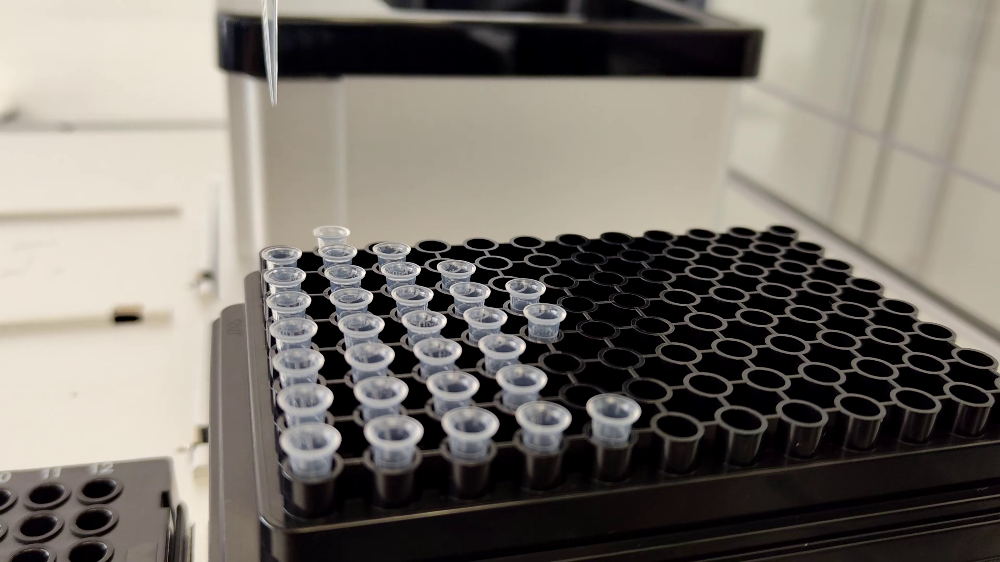

# eviDense UV Photometer at a Glance

The eviDense UV Photometer is a compact photometer for automated UV absorbance measurements on liquid handling platforms. A key application is the UV-absorbance-based determination of nucleic acid concentrations and purity assessment. The instrument integrates into automated workflows in which the liquid handler prepares and transfers the sample, while the eviDense UV Photometer performs the UV absorbance measurement and returns the resulting data for subsequent processing.

The instrument is intended for general laboratory use and research applications. It is not designed, nor classified, as an in-vitro diagnostic device (IVD) and must not be used for in-vitro diagnostic testing.  

For more information see [http://www.on-deck-photometer.com](http://www.on-deck-photometer.com).

This documentation provides the information and resources required to integrate the eviDense UV Photometer into a liquid handling platform, as well as the latest instrument firmware and API software versions for download.

!!! warning "Pre-release software"
    The software is currently pre-release. Behavior, interfaces, documentation, and supported workflows may change before the final release.

## See It in Action

The following video demonstrates a simple eviDense UV Photometer workflow on an Opentrons OT-2 liquid handler.

## What is eviDense UV Photometer?

The eviDense UV is a photometer designed for integration into automated liquid handling workflows. It measures the absorbance of samples at four wavelengths (230, 260, 280, and 340 nm), enabling UV absorbance-based concentration measurements and purity assessment to be performed directly on the liquid handling platform. This allows samples to be measured without leaving the liquid handling platform.

The instrument can be controlled through an API, allowing measuring steps to be incorporated into automated liquid handling protocols. The eviDense UV does not require a separate user interface for routine operation. Measurement commands are sent from the liquid handling software, and the resulting measurement data are returned to the software for further processing.

For an overview of how the eviDense UV fits into an automated laboratory workflow, see [Workflow](applications-workflow.md).

## Where do I go next?

| If you want to... | Start here |
| --- | --- |
| Understand the DNA measurement workflow | [Workflow](applications-workflow.md) |
| Run the available reference setup on an OT-2 | [Opentrons OT-2](integration-kits/opentrons-ot2/index.md) |
| Plan an integration for another liquid handler | [Integration Overview](integration-overview.md) |
| Check firmware or API release information | [Release Notes](software-release-notes.md) |
| Dive into implementation details | [Python](python.md), [C#](csharp.md), or [C CLI](c-cli.md) |
