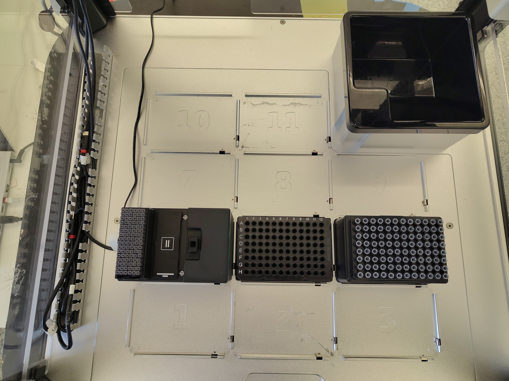

# Opentrons OT-2 Liquid Handler Integration

## 1. Introduction

This document describes a practical starting point for integrating the eviDense UV Python software with an Opentrons OT-2 liquid handler.

## 2. Prerquisites

On the [Opentrons OT-2](https://opentrons.com/robots/ot-2) a [Single-Channel Pipette P20](https://opentrons.com/products/single-channel-electronic-pipette-p20) must be mounted on the left side.

## 3. Installation

### 3.1 Software Setup
1. [SSH](https://support.opentrons.com/en/articles/3287453-connecting-to-your-ot-2-with-ssh) into the OT-2.
1. Install the Python package with:

```bash
python -m pip install https://hseag.github.io/evidense/pre-release/api/python/dist/hse_evidense-0.10.0-py3-none-any.whl
```

If the OT-2 has no internet connection, download the wheel file [hse_evidense-0.10.0-py3-none-any.whl](https://hseag.github.io/evidense/pre-release/api/python/dist/hse_evidense-0.10.0-py3-none-any.whl) and copy it to the device with:

```bash
scp -i ot2_ssh_key hse_evidense-0.10.0-py3-none-any.whl root@YOUR_IP:
```

Then install it locally on the OT-2 with:

```bash
python -m pip install hse_evidense-0.10.0-py3-none-any.whl
```

After the installation, restart the OT-2.

### 3.2 Hardware Setup

1. Connect the eviDense UV to its power supply.
1. Connect the eviDense UV to the OT-2 with the USB cable.
1. Place the eviDense UV on deck slot 4.
1. Add a cuvette rack on slot I on the instrument.
1. Wait until the eviDense UV status LED turns blue during the power-on self-test and then changes to green.
1. Place a compatible `Corning 96 Well Plate 360 uL Flat` on deck slot 5.
1. Place an `Opentrons OT-2 96 Filter Tip Rack 20 uL` on deck slot 6.

The first wells on the plate must contain one or more blanks, for example `A1`, `A2`, `A3`. The sample wells must follow directly after the blanks.



### 3.3 Labware and Protocol

Install the custom labware [hse_evidense_pilot_right_20ul_tip_v3.json](https://hseag.github.io/evidense/pre-release/integration_kits/opentrons-ot2/labware/hse_evidense_pilot_right_20ul_tip_v3.json) and the protocol [evidense_demo_v3.py](https://hseag.github.io/evidense/pre-release/integration_kits/opentrons-ot2/protocols/evidense_demo_v3.py) in the Opentrons App.

The demo protocol uses the following deck layout:

1. Slot 4: eviDense UV with `hse_evidense_pilot_right_20ul_tip_v3`
1. Slot 5: `corning_96_wellplate_360ul_flat`
1. Slot 6: `opentrons_96_filtertiprack_20ul`
1. Left mount: `p20_single_gen2`

The protocol provides the following run parameters in the Opentrons App:

1. `nr_of_std_low`: number of blank measurements at the beginning of the plate, default `1`, allowed range `1..4`. The blanks must start at `A1`.
1. `number_of_samples`: number of sample measurements following the blanks, default `1`, allowed range `1..95`. The samples must start directly after the blanks.
1. `pause_on_error`: pauses the protocol if the eviDense UV reports an error or warning.

The sum of `nr_of_std_low` and `number_of_samples` must not exceed `96`.

## 4. Starting The Protocol

Before running the protocol for the first time, it is recommended to perform the [Labware Position Check](https://docs.opentrons.com/ot-2/calibration/labware-offsets/).

After the protocol has finished, the result files can be accessed through [Jupyter](https://support.opentrons.com/s/article/Running-the-robot-using-Jupyter-Notebook) in the directory `runs/evidense`.

## 5. Detailed Explanation

The custom labware uses the following positions:

- The cuvette guide is located at position `A14`
- The calibration cross is located at position `A1`
- Cuvettes in rack position I use `A2-P2` through `A7-P7`
- Cuvettes in rack position II use `A8-P8` through `A13-P13`

When accessing the cuvettes with [wells()](https://docs.opentrons.com/python-api/reference/labware/#opentrons.protocol_api.Labware.wells), indexing starts at `1`, because `wells()[0]` is the calibration reference at `A1`

The repeated `if self.protocol.is_simulating()` checks are required because the Opentrons simulator can validate deck layout, labware access, and robot motion, but it cannot simulate the connected eviDense UV device.

Without these checks, the protocol would try to execute hardware-dependent operations during simulation, for example:

- creating an `evidense.Run` object
- checking whether the cuvette holder is empty
- starting baseline, air, and sample measurements
- exporting result data as JSON or CSV

These operations only work on a real OT-2 with a connected eviDense UV device. In simulation mode, they would fail because no physical device is available.

In practice, the `is_simulating()` checks separate two execution modes:

- simulation mode: validate protocol flow, well access, and robot movement
- hardware mode: communicate with the eviDense UV device, perform measurements, and store result files
